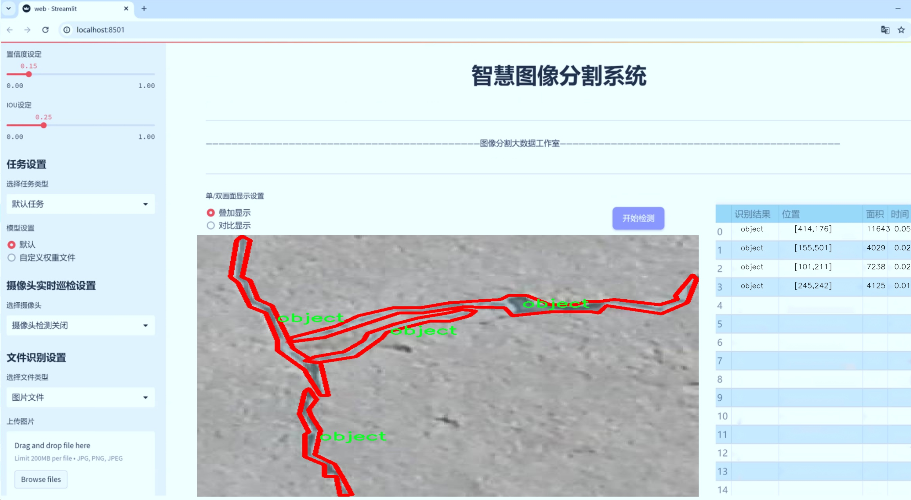
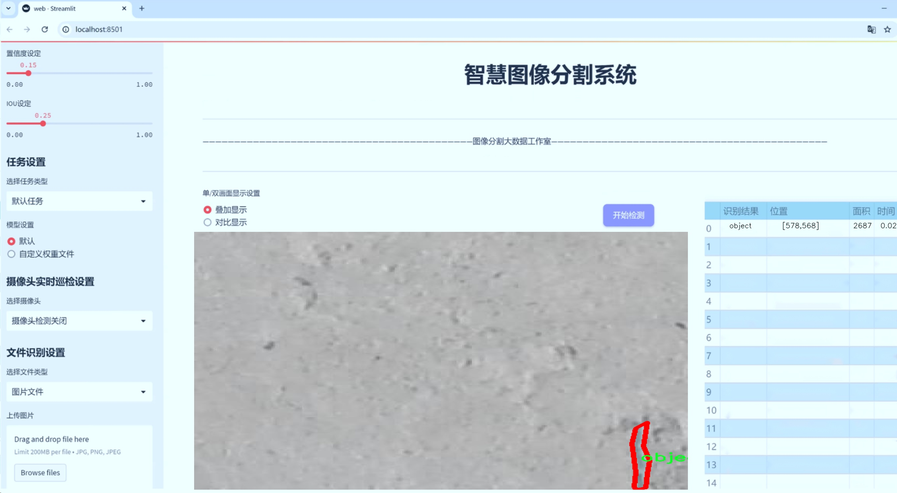
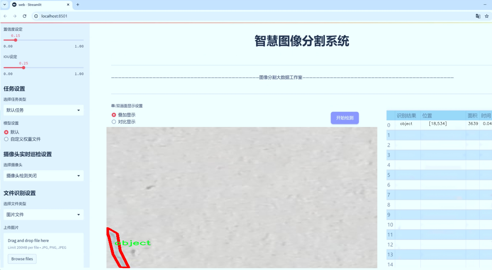
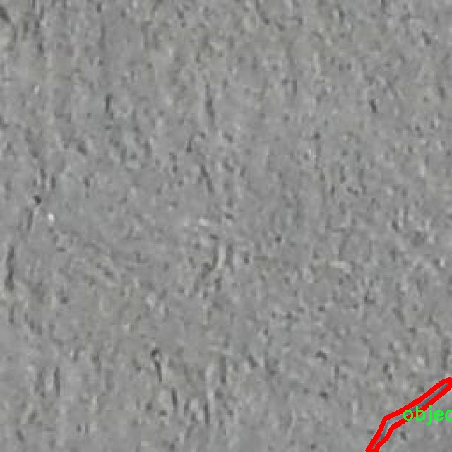
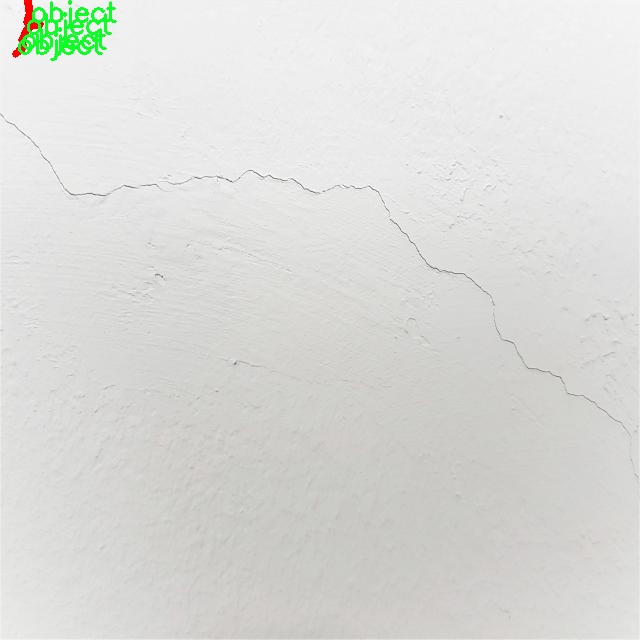
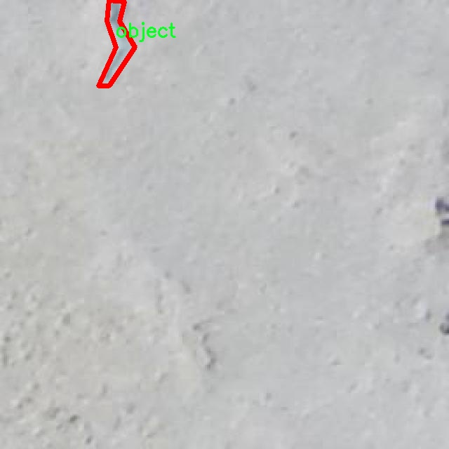
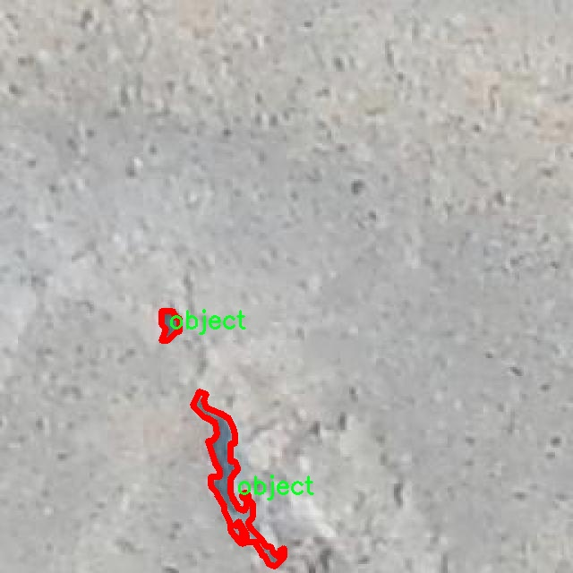
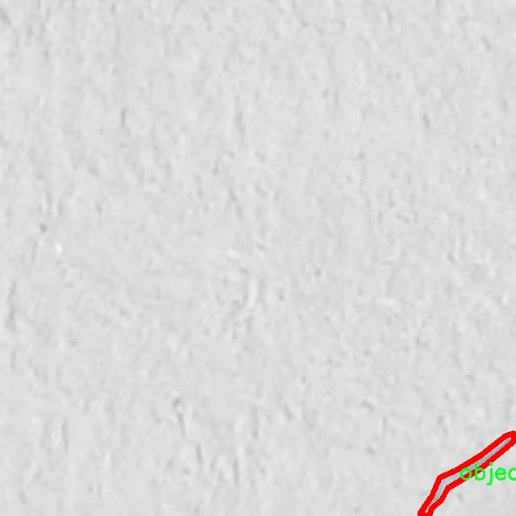

# 混凝土裂缝检测分割系统源码＆数据集分享
 [yolov8-seg-RCSOSA＆yolov8-seg-C2f-REPVGGOREPA等50+全套改进创新点发刊_一键训练教程_Web前端展示]

### 1.研究背景与意义

项目参考[ILSVRC ImageNet Large Scale Visual Recognition Challenge](https://gitee.com/YOLOv8_YOLOv11_Segmentation_Studio/projects)

项目来源[AAAI Global Al lnnovation Contest](https://kdocs.cn/l/cszuIiCKVNis)

研究背景与意义

随着城市化进程的加快，基础设施的建设与维护显得尤为重要，尤其是混凝土结构的安全性与耐久性。混凝土作为一种广泛应用于建筑和工程领域的材料，其在使用过程中常常会出现裂缝，这不仅影响了结构的美观，更可能导致严重的安全隐患。因此，及时、准确地检测和评估混凝土裂缝的情况，对于保障公共安全、延长结构使用寿命具有重要意义。

传统的混凝土裂缝检测方法多依赖人工目测和简单的图像处理技术，这些方法不仅效率低下，而且容易受到人为因素的影响，导致检测结果的不准确性。随着计算机视觉和深度学习技术的迅速发展，基于图像处理的自动化检测方法逐渐成为研究的热点。YOLO（You Only Look Once）系列模型以其高效的实时目标检测能力，在多个领域得到了广泛应用。特别是YOLOv8模型，其在精度和速度上的进一步提升，使其在复杂环境下的应用潜力更为巨大。

本研究旨在基于改进的YOLOv8模型，构建一个高效的混凝土裂缝检测分割系统。通过对1100幅混凝土裂缝图像的实例分割，系统将能够实现对裂缝的精确定位与分割，进而为后续的裂缝评估与修复提供可靠的数据支持。该数据集的构建不仅为模型的训练提供了丰富的样本，还为研究人员在裂缝检测领域的深入探索奠定了基础。

此外，混凝土裂缝检测的研究不仅具有学术价值，更具备重要的实际应用意义。随着人工智能技术的不断进步，基于深度学习的自动化检测系统将大幅提升混凝土结构的检测效率，降低人工成本，减少人为误差。同时，该系统的推广应用将有助于实现对基础设施的智能化管理，提升城市建设的安全性与可持续性。

在技术层面，改进YOLOv8模型的应用，将结合实例分割技术，增强模型对裂缝特征的学习能力，从而提高检测的准确性和鲁棒性。通过对模型的优化与改进，研究将探索如何在复杂背景下有效分离裂缝与背景，进而实现对裂缝的精准识别与分类。这一研究不仅为混凝土裂缝检测提供了新的思路，也为其他领域的目标检测与分割任务提供了借鉴。

综上所述，基于改进YOLOv8的混凝土裂缝检测分割系统的研究，不仅在理论上推动了计算机视觉与深度学习技术的发展，更在实践中为基础设施的安全管理提供了切实可行的解决方案。随着研究的深入，期待该系统能够在更广泛的工程应用中发挥其应有的价值，为构建安全、可靠的城市环境贡献力量。

### 2.图片演示







##### 注意：由于此博客编辑较早，上面“2.图片演示”和“3.视频演示”展示的系统图片或者视频可能为老版本，新版本在老版本的基础上升级如下：（实际效果以升级的新版本为准）

  （1）适配了YOLOV8的“目标检测”模型和“实例分割”模型，通过加载相应的权重（.pt）文件即可自适应加载模型。

  （2）支持“图片识别”、“视频识别”、“摄像头实时识别”三种识别模式。

  （3）支持“图片识别”、“视频识别”、“摄像头实时识别”三种识别结果保存导出，解决手动导出（容易卡顿出现爆内存）存在的问题，识别完自动保存结果并导出到tempDir中。

  （4）支持Web前端系统中的标题、背景图等自定义修改，后面提供修改教程。

  另外本项目提供训练的数据集和训练教程,暂不提供权重文件（best.pt）,需要您按照教程进行训练后实现图片演示和Web前端界面演示的效果。

### 3.视频演示

[3.1 视频演示](https://www.bilibili.com/video/BV12W2HYfEHA/)

### 4.数据集信息展示

##### 4.1 本项目数据集详细数据（类别数＆类别名）

nc: 1
names: ['object']


##### 4.2 本项目数据集信息介绍

数据集信息展示

在现代建筑工程中，混凝土裂缝的检测与修复是确保结构安全和延长使用寿命的重要环节。为了提高混凝土裂缝检测的准确性和效率，研究人员开发了一种基于YOLOv8-seg的混凝土裂缝检测分割系统。在这一系统的训练过程中，使用了名为“concrete crack detection”的数据集，该数据集专门针对混凝土裂缝的检测与分割任务进行了精心设计。

“concrete crack detection”数据集包含了丰富的图像样本，旨在为深度学习模型提供高质量的训练数据。该数据集的类别数量为1，类别列表中仅包含一个类别“object”，这一设计使得模型能够专注于识别和分割混凝土裂缝，而不受其他对象的干扰。这种单一类别的设置，虽然在表面上看似简单，但实际上却为模型的训练提供了更为清晰的目标，使得YOLOv8-seg能够在处理复杂背景和多样化裂缝形态时，依然保持高效的检测能力。

数据集中包含的图像样本来源于不同的建筑工地和实验室环境，涵盖了多种类型的混凝土裂缝，包括但不限于细微裂缝、宽裂缝、横向裂缝和纵向裂缝等。这些样本不仅在数量上具有代表性，而且在质量上经过严格筛选，确保每张图像都能够真实反映混凝土裂缝的特征。此外，数据集中的图像还经过了多种光照和角度的变化处理，使得模型在实际应用中能够具备更强的适应性和鲁棒性。

为了进一步提升模型的性能，数据集还配备了详细的标注信息。每张图像中的裂缝位置和形状都经过精确标注，这为YOLOv8-seg的训练提供了必要的监督信号。通过这些标注，模型能够学习到裂缝的特征与背景的区别，从而在检测过程中实现更高的精度和召回率。

在训练过程中，研究人员还采用了数据增强技术，以增加数据集的多样性和丰富性。这些技术包括随机裁剪、旋转、缩放、颜色变换等，旨在模拟不同的环境条件和裂缝表现。这种增强策略不仅提高了模型的泛化能力，还有效防止了过拟合现象的发生，使得训练出的模型在面对未知数据时，依然能够保持良好的性能。

综上所述，“concrete crack detection”数据集为改进YOLOv8-seg的混凝土裂缝检测分割系统提供了坚实的基础。通过高质量的图像样本、精确的标注信息以及有效的数据增强策略，该数据集在推动混凝土裂缝检测技术的发展方面发挥了重要作用。未来，随着数据集的不断扩展和完善，预计将会有更多的研究者和工程师能够利用这一数据集，开发出更为先进和高效的裂缝检测解决方案，为建筑安全提供更为可靠的保障。











### 5.全套项目环境部署视频教程（零基础手把手教学）

[5.1 环境部署教程链接（零基础手把手教学）](https://www.bilibili.com/video/BV1jG4Ve4E9t/?vd_source=bc9aec86d164b67a7004b996143742dc)


[5.2 安装Python虚拟环境创建和依赖库安装视频教程链接（零基础手把手教学）](https://www.bilibili.com/video/BV1nA4VeYEze/?vd_source=bc9aec86d164b67a7004b996143742dc)

### 6.手把手YOLOV8-seg训练视频教程（零基础小白有手就能学会）

[6.1 手把手YOLOV8-seg训练视频教程（零基础小白有手就能学会）](https://www.bilibili.com/video/BV1cA4VeYETe/?vd_source=bc9aec86d164b67a7004b996143742dc)


按照上面的训练视频教程链接加载项目提供的数据集，运行train.py即可开始训练



     Epoch   gpu_mem       box       obj       cls    labels  img_size
     1/200     0G   0.01576   0.01955  0.007536        22      1280: 100%|██████████| 849/849 [14:42<00:00,  1.04s/it]
               Class     Images     Labels          P          R     mAP@.5 mAP@.5:.95: 100%|██████████| 213/213 [01:14<00:00,  2.87it/s]
                 all       3395      17314      0.994      0.957      0.0957      0.0843

     Epoch   gpu_mem       box       obj       cls    labels  img_size
     2/200     0G   0.01578   0.01923  0.007006        22      1280: 100%|██████████| 849/849 [14:44<00:00,  1.04s/it]
               Class     Images     Labels          P          R     mAP@.5 mAP@.5:.95: 100%|██████████| 213/213 [01:12<00:00,  2.95it/s]
                 all       3395      17314      0.996      0.956      0.0957      0.0845

     Epoch   gpu_mem       box       obj       cls    labels  img_size
     3/200     0G   0.01561    0.0191  0.006895        27      1280: 100%|██████████| 849/849 [10:56<00:00,  1.29it/s]
               Class     Images     Labels          P          R     mAP@.5 mAP@.5:.95: 100%|███████   | 187/213 [00:52<00:00,  4.04it/s]
                 all       3395      17314      0.996      0.957      0.0957      0.0845


### 7.50+种全套YOLOV8-seg创新点代码加载调参视频教程（一键加载写好的改进模型的配置文件）

[7.1 50+种全套YOLOV8-seg创新点代码加载调参视频教程（一键加载写好的改进模型的配置文件）](https://www.bilibili.com/video/BV1Hw4VePEXv/?vd_source=bc9aec86d164b67a7004b996143742dc)

### 8.YOLOV8-seg图像分割算法原理

原始YOLOV8-seg算法原理

YOLO（You Only Look Once）系列算法自其首次提出以来，便在目标检测领域引起了广泛关注。YOLOv8作为该系列的最新版本，于2023年1月发布，代表了目标检测与实例分割技术的前沿。YOLOv8-seg算法不仅继承了YOLO系列的优良传统，还在精度和速度上进行了显著优化，特别是在处理复杂场景和小目标检测方面表现出色。其核心原理可以从网络结构、特征提取、特征融合及检测模块等多个方面进行深入分析。

首先，YOLOv8的网络结构主要由输入层、Backbone骨干网络、Neck特征融合网络和Head检测模块四个部分组成。输入层负责对输入图像进行预处理，包括图像的缩放、裁剪以及Mosaic增强等操作，以提高模型的鲁棒性和适应性。Mosaic增强通过将多张图像合成一张新图像，增加了训练数据的多样性，从而提升了模型的泛化能力。

在Backbone部分，YOLOv8采用了C2f模块替代了之前版本中的C3模块。C2f模块通过引入更多的跳层连接和Split操作，增强了特征图中的信息流动，使得网络能够更有效地捕捉到图像中的细节特征。这种设计不仅提高了特征提取的效率，还保持了模型的轻量级特性，适合在资源受限的环境中运行。通过SPPF（Spatial Pyramid Pooling Fast）模块，YOLOv8能够对不同尺度的特征图进行处理，利用多种尺寸的池化操作合并特征，从而提升了对不同尺度目标的检测能力。

接下来，Neck部分采用了“双塔结构”，结合了特征金字塔网络（FPN）和路径聚合网络（PAN），有效促进了语义特征与定位特征的融合。这种结构的设计使得网络在处理多尺度目标时，能够更好地整合不同层次的特征信息，从而提升了检测的精度和稳定性。特征金字塔网络负责从不同层次提取特征，而路径聚合网络则通过跨层连接，增强了特征之间的联系，使得模型在处理复杂场景时能够更为灵活。

在Head检测模块中，YOLOv8采用了解耦头的结构，将目标的分类和回归任务分开处理。这一创新设计不仅提高了模型的收敛速度，还使得模型在训练过程中能够更专注于每个任务的优化。此外，YOLOv8引入了Anchor-Free的检测机制，摆脱了传统YOLO版本中依赖锚框的局限性。这一改变使得模型在处理小目标和高分辨率图像时，能够更为高效，避免了锚框设计带来的复杂性和不确定性。

YOLOv8的损失函数也进行了优化，旨在更好地平衡分类和回归任务的损失，从而提升整体检测性能。通过对损失函数的改进，YOLOv8能够在不同场景下保持较高的准确性，尤其是在目标密集或遮挡严重的情况下，依然能够有效地进行目标检测与分割。

值得一提的是，YOLOv8不仅在算法设计上进行了创新，还在模型的实际应用中展现出了极大的灵活性。它能够在多种硬件平台上运行，从CPU到GPU，均能实现高效的目标检测与实例分割。这种广泛的适用性使得YOLOv8成为了计算机视觉领域中极具潜力的工具，适合于自动驾驶、安防监控、智能家居等多个应用场景。

综上所述，YOLOv8-seg算法通过一系列的结构优化和创新设计，显著提升了目标检测与实例分割的性能。其独特的Backbone、Neck和Head设计，使得YOLOv8在处理复杂场景和小目标时，能够展现出卓越的能力。随着YOLOv8的不断发展与应用，未来在计算机视觉领域的影响力将愈加显著，推动着智能技术的进一步进步。


### 9.系统功能展示（检测对象为举例，实际内容以本项目数据集为准）

图9.1.系统支持检测结果表格显示

  图9.2.系统支持置信度和IOU阈值手动调节

  图9.3.系统支持自定义加载权重文件best.pt(需要你通过步骤5中训练获得)

  图9.4.系统支持摄像头实时识别

  图9.5.系统支持图片识别

  图9.6.系统支持视频识别

  图9.7.系统支持识别结果文件自动保存

  图9.8.系统支持Excel导出检测结果数据


### 10.50+种全套YOLOV8-seg创新点原理讲解（非科班也可以轻松写刊发刊，V11版本正在科研待更新）

#### 10.1 由于篇幅限制，每个创新点的具体原理讲解就不一一展开，具体见下列网址中的创新点对应子项目的技术原理博客网址【Blog】：


[10.1 50+种全套YOLOV8-seg创新点原理讲解链接](https://gitee.com/qunmasj/good)

#### 10.2 部分改进模块原理讲解(完整的改进原理见上图和技术博客链接)【此小节的图要是加载失败请移步原始博客查看，链接：https://blog.csdn.net/cheng2333333?type=blog】
### YOLOv8算法原理
YOLOv8算法由Glenn-Jocher 提出，是跟YOLOv3算法、YOLOv5算法一脉相承的，主要的改进点如下:
(1)数据预处理。YOLOv8的数据预处理依旧采用YOLOv5的策略,在训练时，主要采用包括马赛克增强(Mosaic)、混合增强(Mixup)、空间扰动(randomperspective)以及颜色扰动(HSV augment)四个增强手段。
(2)骨干网络结构。YOLOv8的骨干网络结构可从YOLOv5略见一斑，YOLOv5的主干网络的架构规律十分清晰，总体来看就是每用一层步长为2的3×3卷积去降采样特征图，接一个C3模块来进一步强化其中的特征，且C3的基本深度参数分别为“3/6/9/3”，其会根据不同规模的模型的来做相应的缩放。在的YOLOv8中，大体上也还是继承了这一特点，原先的C3模块均被替换成了新的C2f模块，C2f 模块加入更多的分支，丰富梯度回传时的支流。下面展示了YOLOv8的C2f模块和YOLOv5的C3模块，其网络结构图所示。


(3)FPN-PAN结构。YOLOv8仍采用FPN+PAN结构来构建YOLO的特征金字塔，使多尺度信息之间进行充分的融合。除了FPN-PAN里面的C3模块被替换为C2f模块外，其余部分与YOLOv5的FPN-PAN结构基本一致。
(4)Detection head结构。从 YOLOv3到 YOLOv5，其检测头一直都是“耦合”(Coupled)的,即使用一层卷积同时完成分类和定位两个任务，直到YOLOX的问世， YOLO系列才第一次换装“解耦头”(Decoupled Head)。YOLOv8也同样也采用了解耦头的结构，两条并行的分支分别取提取类别特征和位置特征，然后各用一层1x1卷积完成分类和定位任务。YOLOv8整体的网络结构由图所示。


(5)标签分配策略。尽管YOLOv5设计了自动聚类候选框的一些功能，但是聚类候选框是依赖于数据集的。若数据集不够充分，无法较为准确地反映数据本身的分布特征，聚类出来的候选框也会与真实物体尺寸比例悬殊过大。YOLOv8没有采用候选框策略，所以解决的问题就是正负样本匹配的多尺度分配。不同于YOLOX所使用的 SimOTA，YOLOv8在标签分配问题上采用了和YOLOv6相同的TOOD策略，是一种动态标签分配策略。YOLOv8只用到了targetboze。和target scores，未含是否有物体预测，故 YOLOv8的损失就主要包括两大部分∶类别损失和位置损失。对于YOLOv8，其分类损失为VFLLoss(Varifocal Loss)，其回归损失为CIoU Loss 与 DFL Loss 的形式。
其中 Varifocal Loss定义如下:


其中p为预测的类别得分，p ∈ [0.1]。q为预测的目标分数(若为真实类别，则q为预测和真值的 loU;若为其他类别。q为0 )。VFL Loss使用不对称参数来对正负样本进行加权，通过只对负样本进行衰减，达到不对等的处理前景和背景对损失的贡献。对正样本，使用q进行了加权，如果正样本的GTiou很高时,则对损失的贡献更大一些，可以让网络聚焦于那些高质量的样本上，即训练高质量的正例对AP的提升比低质量的更大一些。对负样本，使用p进行了降权，降低了负例对损失的贡献，因负样本的预测p在取次幂后会变得更小，这样就能够降低负样本对损失的整体贡献。

### 动态蛇形卷积Dynamic Snake Convolution

参考论文： 2307.08388.pdf (arxiv.org)

血管、道路等拓扑管状结构的精确分割在各个领域都至关重要，确保下游任务的准确性和效率。 然而，许多因素使任务变得复杂，包括薄的局部结构和可变的全局形态。在这项工作中，我们注意到管状结构的特殊性，并利用这些知识来指导我们的 DSCNet 在三个阶段同时增强感知：特征提取、特征融合、 和损失约束。 首先，我们提出了一种动态蛇卷积，通过自适应地关注细长和曲折的局部结构来准确捕获管状结构的特征。 随后，我们提出了一种多视图特征融合策略，以补充特征融合过程中多角度对特征的关注，确保保留来自不同全局形态的重要信息。 最后，提出了一种基于持久同源性的连续性约束损失函数，以更好地约束分割的拓扑连续性。 2D 和 3D 数据集上的实验表明，与多种方法相比，我们的 DSCNet 在管状结构分割任务上提供了更好的准确性和连续性。 我们的代码是公开的。 
主要的挑战源于细长微弱的局部结构特征与复杂多变的全局形态特征。本文关注到管状结构细长连续的特点，并利用这一信息在神经网络以下三个阶段同时增强感知：特征提取、特征融合和损失约束。分别设计了动态蛇形卷积（Dynamic Snake Convolution），多视角特征融合策略与连续性拓扑约束损失。 

我们希望卷积核一方面能够自由地贴合结构学习特征，另一方面能够在约束条件下不偏离目标结构太远。在观察管状结构的细长连续的特征后，脑海里想到了一个动物——蛇。我们希望卷积核能够像蛇一样动态地扭动，来贴合目标的结构。

我们希望卷积核一方面能够自由地贴合结构学习特征，另一方面能够在约束条件下不偏离目标结构太远。在观察管状结构的细长连续的特征后，脑海里想到了一个动物——蛇。我们希望卷积核能够像蛇一样动态地扭动，来贴合目标的结构。


### DCNV2融入YOLOv8
DCN和DCNv2（可变性卷积）
网上关于两篇文章的详细描述已经很多了，我这里具体的细节就不多讲了，只说一下其中实现起来比较困惑的点。（黑体字会讲解）

DCNv1解决的问题就是我们常规的图像增强，仿射变换（线性变换加平移）不能解决的多种形式目标变换的几何变换的问题。如下图所示。

可变性卷积的思想很简单，就是讲原来固定形状的卷积核变成可变的。如下图所示：


首先来看普通卷积，以3x3卷积为例对于每个输出y(p0)，都要从x上采样9个位置，这9个位置都在中心位置x(p0)向四周扩散得到的gird形状上，(-1,-1)代表x(p0)的左上角，(1,1)代表x(p0)的右下角，其他类似。

用公式表示如下：


可变性卷积Deformable Conv操作并没有改变卷积的计算操作，而是在卷积操作的作用区域上，加入了一个可学习的参数∆pn。同样对于每个输出y(p0)，都要从x上采样9个位置，这9个位置是中心位置x(p0)向四周扩散得到的，但是多了 ∆pn，允许采样点扩散成非gird形状。


偏移量是通过对原始特征层进行卷积得到的。比如输入特征层是w×h×c，先对输入的特征层进行卷积操作，得到w×h×2c的offset field。这里的w和h和原始特征层的w和h是一致的，offset field里面的值是输入特征层对应位置的偏移量，偏移量有x和y两个方向，所以offset field的channel数是2c。offset field里的偏移量是卷积得到的，可能是浮点数，所以接下来需要通过双向性插值计算偏移位置的特征值。在偏移量的学习中，梯度是通过双线性插值来进行反向传播的。
看到这里是不是还是有点迷茫呢？那到底程序上面怎么实现呢？


事实上由上面的公式我们可以看得出来∆pn这个偏移量是加在原像素点上的，但是我们怎么样从代码上对原像素点加这个量呢？其实很简单，就是用一个普通的卷积核去跟输入图片（一般是输入的feature_map）卷积就可以了卷积核的数量是2N也就是23*3==18（前9个通道是x方向的偏移量，后9个是y方向的偏移量），然后把这个卷积的结果与正常卷积的结果进行相加就可以了。
然后又有了第二个问题，怎么样反向传播呢？为什么会有这个问题呢？因为求出来的偏移量+正常卷积输出的结果往往是一个浮点数，浮点数是无法对应到原图的像素点的，所以自然就想到了双线性差值的方法求出浮点数对应的浮点像素点。


#### DCN v2
对于positive的样本来说，采样的特征应该focus在RoI内，如果特征中包含了过多超出RoI的内容，那么结果会受到影响和干扰。而negative样本则恰恰相反，引入一些超出RoI的特征有助于帮助网络判别这个区域是背景区域。

DCNv1引入了可变形卷积，能更好的适应目标的几何变换。但是v1可视化结果显示其感受野对应位置超出了目标范围，导致特征不受图像内容影响（理想情况是所有的对应位置分布在目标范围以内）。

为了解决该问题：提出v2, 主要有

1、扩展可变形卷积，增强建模能力
2、提出了特征模拟方案指导网络培训：feature mimicking scheme

上面这段话是什么意思呢，通俗来讲就是，我们的可变性卷积的区域大于目标所在区域，所以这时候就会对非目标区域进行错误识别。

所以自然能想到的解决方案就是加入权重项进行惩罚。（至于这个实现起来就比较简单了，直接初始化一个权重然后乘(input+offsets)就可以了）


可调节的RoIpooling也是类似的，公式如下：


### 11.项目核心源码讲解（再也不用担心看不懂代码逻辑）

#### 11.1 ui.py

以下是经过简化和注释的核心代码部分：

```python
import sys
import subprocess
from QtFusion.path import abs_path

def run_script(script_path):
    """
    使用当前 Python 环境运行指定的脚本。

    Args:
        script_path (str): 要运行的脚本路径
    """
    # 获取当前 Python 解释器的路径
    python_path = sys.executable

    # 构建运行命令，使用 streamlit 运行指定的脚本
    command = f'"{python_path}" -m streamlit run "{script_path}"'

    # 执行命令并等待其完成
    result = subprocess.run(command, shell=True)
    
    # 检查命令执行结果，如果返回码不为0，表示出错
    if result.returncode != 0:
        print("脚本运行出错。")

# 主程序入口
if __name__ == "__main__":
    # 获取脚本的绝对路径
    script_path = abs_path("web.py")

    # 运行指定的脚本
    run_script(script_path)
```

### 代码注释说明：
1. **导入模块**：
   - `sys`：用于获取当前 Python 解释器的路径。
   - `subprocess`：用于执行外部命令。
   - `abs_path`：从 `QtFusion.path` 导入的函数，用于获取文件的绝对路径。

2. **`run_script` 函数**：
   - 接受一个参数 `script_path`，表示要运行的 Python 脚本的路径。
   - 使用 `sys.executable` 获取当前 Python 解释器的路径。
   - 构建一个命令字符串，用于调用 `streamlit` 运行指定的脚本。
   - 使用 `subprocess.run` 执行命令，并等待其完成。
   - 检查命令的返回码，如果不为0，打印错误信息。

3. **主程序入口**：
   - 使用 `abs_path` 获取 `web.py` 的绝对路径。
   - 调用 `run_script` 函数运行该脚本。

这个文件是一个 Python 脚本，主要功能是运行一个名为 `web.py` 的脚本。首先，文件导入了必要的模块，包括 `sys`、`os` 和 `subprocess`，这些模块提供了与系统交互和执行外部命令的功能。此外，还导入了 `QtFusion.path` 模块中的 `abs_path` 函数，用于获取文件的绝对路径。

在 `run_script` 函数中，接受一个参数 `script_path`，这个参数是要运行的脚本的路径。函数首先获取当前 Python 解释器的路径，然后构建一个命令字符串，这个命令用于使用 `streamlit` 模块运行指定的脚本。接着，使用 `subprocess.run` 方法执行这个命令，并通过 `shell=True` 选项在一个新的 shell 中运行它。

如果脚本运行的返回码不为零，表示执行过程中出现了错误，函数会打印出“脚本运行出错”的提示信息。

在文件的最后部分，使用 `if __name__ == "__main__":` 语句来确保只有在直接运行该脚本时才会执行以下代码。这里指定了要运行的脚本路径，调用 `abs_path` 函数获取 `web.py` 的绝对路径，并最终调用 `run_script` 函数来执行这个脚本。

总的来说，这个文件的主要作用是为运行一个 Streamlit 应用提供一个简单的接口，方便用户通过该脚本启动指定的 Python 脚本。

#### 11.2 ultralytics\nn\backbone\CSwomTramsformer.py

以下是经过简化并注释的核心代码部分，主要保留了 CSWin Transformer 的结构和关键组件。

```python
import torch
import torch.nn as nn
import numpy as np

class Mlp(nn.Module):
    """多层感知机（MLP）模块"""
    def __init__(self, in_features, hidden_features=None, out_features=None, act_layer=nn.GELU, drop=0.):
        super().__init__()
        out_features = out_features or in_features  # 输出特征数
        hidden_features = hidden_features or in_features  # 隐藏层特征数
        self.fc1 = nn.Linear(in_features, hidden_features)  # 第一层线性变换
        self.act = act_layer()  # 激活函数
        self.fc2 = nn.Linear(hidden_features, out_features)  # 第二层线性变换
        self.drop = nn.Dropout(drop)  # Dropout层

    def forward(self, x):
        """前向传播"""
        x = self.fc1(x)
        x = self.act(x)
        x = self.drop(x)
        x = self.fc2(x)
        x = self.drop(x)
        return x

class CSWinBlock(nn.Module):
    """CSWin Transformer的基本块"""
    def __init__(self, dim, num_heads, mlp_ratio=4., drop=0., attn_drop=0.):
        super().__init__()
        self.dim = dim  # 输入特征维度
        self.num_heads = num_heads  # 注意力头数
        self.mlp_ratio = mlp_ratio  # MLP隐藏层比率
        self.qkv = nn.Linear(dim, dim * 3)  # 线性变换用于生成Q、K、V
        self.norm1 = nn.LayerNorm(dim)  # 第一层归一化
        self.attn = LePEAttention(dim, num_heads=num_heads, attn_drop=attn_drop)  # 注意力层
        self.mlp = Mlp(in_features=dim, hidden_features=int(dim * mlp_ratio), out_features=dim)  # MLP层
        self.drop = nn.Dropout(drop)  # Dropout层

    def forward(self, x):
        """前向传播"""
        x = self.norm1(x)  # 归一化
        qkv = self.qkv(x).reshape(x.shape[0], -1, 3, self.dim).permute(2, 0, 1, 3)  # 生成Q、K、V
        x = self.attn(qkv)  # 注意力计算
        x = x + self.drop(x)  # 残差连接
        x = x + self.drop(self.mlp(x))  # MLP后残差连接
        return x

class CSWinTransformer(nn.Module):
    """CSWin Transformer模型"""
    def __init__(self, img_size=640, in_chans=3, num_classes=1000, embed_dim=96, depth=[2, 2, 6, 2], num_heads=12):
        super().__init__()
        self.num_classes = num_classes
        self.embed_dim = embed_dim  # 嵌入维度
        self.stage1_conv_embed = nn.Sequential(
            nn.Conv2d(in_chans, embed_dim, kernel_size=7, stride=4, padding=3),  # 初始卷积层
            nn.LayerNorm(embed_dim)  # 归一化层
        )
        self.stage1 = nn.ModuleList([
            CSWinBlock(dim=embed_dim, num_heads=num_heads) for _ in range(depth[0])  # 第一阶段的CSWinBlock
        ])
        # 其他阶段省略，类似于第一阶段

    def forward(self, x):
        """前向传播"""
        x = self.stage1_conv_embed(x)  # 初始卷积嵌入
        for blk in self.stage1:
            x = blk(x)  # 通过每个CSWinBlock
        return x

# 示例代码，创建模型并进行前向传播
if __name__ == '__main__':
    inputs = torch.randn((1, 3, 640, 640))  # 输入数据
    model = CSWinTransformer()  # 创建模型
    res = model(inputs)  # 前向传播
    print(res.size())  # 输出结果的尺寸
```

### 代码说明：
1. **Mlp类**：实现了一个简单的多层感知机，包含两个线性层和一个激活函数。
2. **CSWinBlock类**：实现了CSWin Transformer的基本块，包含注意力机制和MLP层。
3. **CSWinTransformer类**：整体模型结构，包含初始卷积层和多个CSWinBlock的堆叠。
4. **前向传播**：模型的输入经过初始卷积层和多个CSWinBlock，最终输出特征。

这段代码展示了CSWin Transformer的基本结构和前向传播过程，省略了其他复杂的细节和辅助函数。

该程序文件实现了CSWin Transformer模型，这是一个用于计算机视觉任务的深度学习模型。文件中包含了多个类和函数，主要用于构建CSWin Transformer的不同组件。

首先，文件引入了必要的库，包括PyTorch及其神经网络模块、功能模块、图像处理库以及一些辅助函数。文件的开头部分包含版权信息和作者信息。

接下来，定义了几个核心类。`Mlp`类实现了一个多层感知机（MLP），包括两个线性层和一个激活函数（默认为GELU），并且在每个线性层后面都有dropout层用于防止过拟合。

`LePEAttention`类实现了一个改进的注意力机制，名为LePE（Learnable Position Embedding），该机制在计算注意力时将输入图像划分为窗口，并通过卷积层获取位置嵌入。该类的`forward`方法负责计算查询、键、值的注意力权重，并将其应用于输入。

`CSWinBlock`类是CSWin Transformer的基本构建块，包含了一个注意力层和一个MLP层。它通过线性层将输入的特征进行变换，并通过残差连接将输入与输出结合。

`img2windows`和`windows2img`函数用于在图像和窗口之间进行转换，帮助模型处理图像数据。

`Merge_Block`类用于合并不同分辨率的特征图，通过卷积层进行下采样，并进行层归一化。

`CSWinTransformer`类是整个模型的主类，负责构建模型的各个阶段，包括输入的卷积嵌入、多个CSWinBlock的堆叠以及特征的合并。模型的构造参数包括图像大小、嵌入维度、深度、头数等。该类的`forward_features`方法负责通过各个阶段的处理并返回特征。

文件还定义了一些辅助函数，如`_conv_filter`用于转换权重，`update_weight`用于更新模型权重，以及不同规模的CSWin Transformer模型的构造函数（如`CSWin_tiny`、`CSWin_small`、`CSWin_base`和`CSWin_large`），这些函数允许用户创建不同大小和复杂度的模型。

最后，文件的主程序部分用于测试不同规模的CSWin Transformer模型，生成随机输入并输出模型的特征图大小。

整体来看，该文件实现了一个高效的视觉Transformer模型，结合了卷积和自注意力机制，适用于各种计算机视觉任务。

#### 11.3 ultralytics\__init__.py

以下是代码中最核心的部分，并附上详细的中文注释：

```python
# 导入Ultralytics YOLO库及其相关模块
# Ultralytics YOLO 🚀, AGPL-3.0 license

# 定义当前版本
__version__ = '8.0.202'

# 从ultralytics.models模块中导入多个模型
from ultralytics.models import RTDETR, SAM, YOLO  # 导入实时目标检测模型RTDETR、分割模型SAM和YOLO模型
from ultralytics.models.fastsam import FastSAM  # 导入快速分割模型FastSAM
from ultralytics.models.nas import NAS  # 导入神经架构搜索模型NAS

# 导入设置和检查工具
from ultralytics.utils import SETTINGS as settings  # 导入设置
from ultralytics.utils.checks import check_yolo as checks  # 导入YOLO检查工具
from ultralytics.utils.downloads import download  # 导入下载工具

# 定义模块的公开接口，包含版本信息和导入的模型及工具
__all__ = '__version__', 'YOLO', 'NAS', 'SAM', 'FastSAM', 'RTDETR', 'checks', 'download', 'settings'
```

### 注释说明：
1. **版本定义**：`__version__` 变量用于标识当前代码的版本，方便版本管理和追踪。
2. **模型导入**：从 `ultralytics.models` 模块中导入了多种模型，包括目标检测和分割模型，适用于不同的计算机视觉任务。
3. **工具导入**：导入了一些实用工具，包括设置、检查和下载功能，便于后续使用。
4. **公开接口**：`__all__` 变量定义了模块的公开接口，指明了哪些变量和类可以被外部访问，有助于模块的封装和管理。

这个程序文件是Ultralytics库的初始化文件，文件名为`__init__.py`，它的主要作用是定义该库的版本信息以及导入和暴露库中的主要模块和功能。

首先，文件开头包含了一条注释，说明这是Ultralytics YOLO的代码，并且该代码遵循AGPL-3.0许可证。接着，定义了一个版本号`__version__`，其值为'8.0.202'，这表明该库的当前版本。

随后，文件导入了多个模型和工具函数。具体来说，它从`ultralytics.models`模块中导入了`RTDETR`、`SAM`和`YOLO`这三个模型类，此外还从`ultralytics.models.fastsam`模块中导入了`FastSAM`，从`ultralytics.models.nas`模块中导入了`NAS`。这些模型类是Ultralytics库的核心部分，分别用于不同的计算机视觉任务。

接下来，文件还导入了一些实用工具。`SETTINGS`被导入为`settings`，可能用于配置库的运行参数；`check_yolo`被导入为`checks`，用于进行YOLO模型的检查；`download`函数用于下载相关资源或模型。

最后，`__all__`变量被定义为一个元组，包含了所有希望在使用`from ultralytics import *`时暴露的模块和功能。这包括版本号、模型类、检查函数、下载函数以及设置。

总的来说，这个`__init__.py`文件是Ultralytics库的入口，负责版本管理和模块的组织，使得用户可以方便地使用库中的功能。

#### 11.4 ultralytics\utils\callbacks\neptune.py

以下是代码中最核心的部分，并附上详细的中文注释：

```python
# 导入必要的库
from ultralytics.utils import LOGGER, SETTINGS, TESTS_RUNNING

# 尝试导入NeptuneAI库并进行初始化
try:
    assert not TESTS_RUNNING  # 确保不是在测试环境中
    assert SETTINGS['neptune'] is True  # 确保Neptune集成已启用
    import neptune
    from neptune.types import File

    assert hasattr(neptune, '__version__')  # 确保Neptune库版本存在

    run = None  # NeptuneAI实验记录实例

except (ImportError, AssertionError):
    neptune = None  # 如果导入失败，则将neptune设置为None


def _log_scalars(scalars, step=0):
    """将标量数据记录到NeptuneAI实验记录器中。"""
    if run:  # 如果Neptune记录器已初始化
        for k, v in scalars.items():  # 遍历标量字典
            run[k].append(value=v, step=step)  # 记录标量值和步骤


def _log_images(imgs_dict, group=''):
    """将图像记录到NeptuneAI实验记录器中。"""
    if run:  # 如果Neptune记录器已初始化
        for k, v in imgs_dict.items():  # 遍历图像字典
            run[f'{group}/{k}'].upload(File(v))  # 上传图像文件


def on_pretrain_routine_start(trainer):
    """在训练例程开始之前调用的回调函数。"""
    try:
        global run
        # 初始化Neptune运行实例
        run = neptune.init_run(project=trainer.args.project or 'YOLOv8', name=trainer.args.name, tags=['YOLOv8'])
        # 记录超参数配置
        run['Configuration/Hyperparameters'] = {k: '' if v is None else v for k, v in vars(trainer.args).items()}
    except Exception as e:
        LOGGER.warning(f'WARNING ⚠️ NeptuneAI安装但未正确初始化，未记录此运行。 {e}')


def on_train_epoch_end(trainer):
    """每个训练周期结束时调用的回调函数。"""
    # 记录训练损失和学习率
    _log_scalars(trainer.label_loss_items(trainer.tloss, prefix='train'), trainer.epoch + 1)
    _log_scalars(trainer.lr, trainer.epoch + 1)
    if trainer.epoch == 1:  # 在第一个周期结束时记录图像
        _log_images({f.stem: str(f) for f in trainer.save_dir.glob('train_batch*.jpg')}, 'Mosaic')


def on_val_end(validator):
    """每次验证结束时调用的回调函数。"""
    if run:
        # 记录验证图像
        _log_images({f.stem: str(f) for f in validator.save_dir.glob('val*.jpg')}, 'Validation')


def on_train_end(trainer):
    """训练结束时调用的回调函数。"""
    if run:
        # 记录最终结果和混淆矩阵
        files = [
            'results.png', 'confusion_matrix.png', 'confusion_matrix_normalized.png',
            *(f'{x}_curve.png' for x in ('F1', 'PR', 'P', 'R'))]
        files = [(trainer.save_dir / f) for f in files if (trainer.save_dir / f).exists()]  # 过滤存在的文件
        for f in files:
            _log_plot(title=f.stem, plot_path=f)  # 记录图表
        # 记录最终模型
        run[f'weights/{trainer.args.name or trainer.args.task}/{str(trainer.best.name)}'].upload(File(str(trainer.best)))


# 定义回调函数字典
callbacks = {
    'on_pretrain_routine_start': on_pretrain_routine_start,
    'on_train_epoch_end': on_train_epoch_end,
    'on_val_end': on_val_end,
    'on_train_end': on_train_end} if neptune else {}
```

### 代码核心部分解释：
1. **NeptuneAI的初始化**：尝试导入Neptune库并进行初始化，确保在训练过程中可以记录实验数据。
2. **记录标量和图像**：定义了 `_log_scalars` 和 `_log_images` 函数，用于将训练过程中的标量数据和图像上传到Neptune。
3. **训练过程的回调函数**：包括 `on_pretrain_routine_start`、`on_train_epoch_end`、`on_val_end` 和 `on_train_end`，这些函数在训练的不同阶段被调用，用于记录超参数、损失、学习率、验证结果等信息。
4. **回调函数字典**：根据是否成功导入Neptune，定义了一个回调函数字典，以便在训练过程中调用相应的函数。

这个程序文件是一个用于与NeptuneAI集成的回调函数模块，主要用于在训练YOLO模型时记录和上传训练过程中的各种信息和结果。文件首先导入了一些必要的模块和设置，包括日志记录器、设置参数和测试状态。接着，它尝试导入Neptune库，并进行一些基本的验证，如确保没有在运行测试（pytest）以及Neptune集成是否启用。如果导入失败或验证不通过，则将`neptune`设置为`None`。

文件中定义了一些私有函数，用于记录标量数据、图像和绘图。`_log_scalars`函数用于将标量数据（如损失值和学习率）记录到Neptune中；`_log_images`函数用于上传图像文件；而`_log_plot`函数则用于记录绘图结果。`_log_plot`函数使用`matplotlib`库读取图像并将其上传。

接下来，文件定义了一系列回调函数，这些函数在训练的不同阶段被调用。`on_pretrain_routine_start`函数在训练开始前被调用，负责初始化Neptune的运行实例并记录超参数配置。`on_train_epoch_end`函数在每个训练周期结束时被调用，记录训练损失和学习率，并在第一个周期结束时上传训练批次的图像。`on_fit_epoch_end`函数在每个训练和验证周期结束时被调用，记录模型的配置信息和指标。`on_val_end`函数在验证结束时被调用，上传验证集的图像。最后，`on_train_end`函数在训练结束时被调用，记录最终的结果、混淆矩阵和其他相关图表，并上传最佳模型的权重。

最后，文件将这些回调函数组织成一个字典，方便在训练过程中调用。如果Neptune未正确导入，则该字典将为空。这使得整个模块在Neptune集成可用时能够正常工作，而在不可用时则不会影响其他功能。

#### 11.5 train.py

以下是经过简化和注释的核心代码部分：

```python
import os
import torch
import yaml
from ultralytics import YOLO  # 导入YOLO模型库

if __name__ == '__main__':  # 确保该模块被直接运行时才执行以下代码
    # 设置训练参数
    workers = 1  # 数据加载的工作进程数
    batch = 8  # 每个批次的样本数量
    device = "0" if torch.cuda.is_available() else "cpu"  # 判断是否使用GPU

    # 获取数据集配置文件的绝对路径
    data_path = abs_path(f'datasets/data/data.yaml', path_type='current')

    # 将路径格式转换为Unix风格
    unix_style_path = data_path.replace(os.sep, '/')
    # 获取目录路径
    directory_path = os.path.dirname(unix_style_path)

    # 读取YAML配置文件
    with open(data_path, 'r') as file:
        data = yaml.load(file, Loader=yaml.FullLoader)

    # 修改数据集路径
    if 'train' in data and 'val' in data and 'test' in data:
        data['train'] = directory_path + '/train'  # 设置训练集路径
        data['val'] = directory_path + '/val'      # 设置验证集路径
        data['test'] = directory_path + '/test'    # 设置测试集路径

        # 将修改后的数据写回YAML文件
        with open(data_path, 'w') as file:
            yaml.safe_dump(data, file, sort_keys=False)

    # 加载YOLO模型配置和预训练权重
    model = YOLO(r"C:\codeseg\codenew\50+种YOLOv8算法改进源码大全和调试加载训练教程（非必要）\改进YOLOv8模型配置文件\yolov8-seg-C2f-Faster.yaml").load("./weights/yolov8s-seg.pt")

    # 开始训练模型
    results = model.train(
        data=data_path,  # 指定训练数据的配置文件路径
        device=device,  # 使用的设备（GPU或CPU）
        workers=workers,  # 数据加载的工作进程数
        imgsz=640,  # 输入图像的大小
        epochs=100,  # 训练的轮数
        batch=batch,  # 每个批次的样本数量
    )
```

### 代码注释说明：
1. **导入库**：导入必要的库，包括操作系统、PyTorch、YAML解析库和YOLO模型库。
2. **主程序入口**：使用`if __name__ == '__main__':`确保代码块仅在直接运行该脚本时执行。
3. **设置训练参数**：定义数据加载的工作进程数、批次大小和设备（GPU或CPU）。
4. **获取数据集配置文件路径**：使用`abs_path`函数获取数据集配置文件的绝对路径。
5. **读取和修改YAML文件**：读取YAML文件，修改训练、验证和测试集的路径，并将修改后的内容写回文件。
6. **加载YOLO模型**：根据指定的配置文件和预训练权重加载YOLO模型。
7. **训练模型**：调用`model.train()`方法开始训练，传入必要的参数，包括数据路径、设备、工作进程数、图像大小、训练轮数和批次大小。

这个程序文件 `train.py` 是用于训练 YOLO（You Only Look Once）目标检测模型的脚本。首先，它导入了一些必要的库，包括 `os`、`torch`、`yaml` 和 `matplotlib`，并从 `ultralytics` 库中导入了 YOLO 模型。程序的主要功能是在直接运行该脚本时执行训练过程。

在 `__main__` 块中，首先设置了一些训练参数，包括工作进程数 `workers`、批次大小 `batch` 和设备类型 `device`。设备类型会根据是否有可用的 GPU 自动选择，如果有 GPU 则使用 GPU（标记为 "0"），否则使用 CPU。

接下来，程序通过 `abs_path` 函数获取数据集配置文件 `data.yaml` 的绝对路径，并将其转换为 UNIX 风格的路径。然后，程序提取出数据集目录的路径，并打开 YAML 文件读取其内容。此时，程序检查 YAML 文件中是否包含 `train`、`val` 和 `test` 字段，如果存在，则将这些字段的路径修改为相应的训练、验证和测试数据集的路径，并将修改后的内容写回到 YAML 文件中。

程序还提醒用户注意，不同的 YOLO 模型对设备的要求不同，如果在训练时遇到内存不足的错误，可以尝试使用其他模型进行测试。接着，程序加载了一个指定的 YOLO 模型配置文件，并使用预训练的权重文件进行初始化。

最后，程序调用 `model.train()` 方法开始训练模型，传入的数据包括数据配置文件路径、设备类型、工作进程数、输入图像大小、训练的 epoch 数量和批次大小等参数。这一系列设置确保了模型能够在指定的条件下进行有效的训练。

#### 11.6 ultralytics\trackers\basetrack.py

以下是经过简化并注释的核心代码部分：

```python
# 导入必要的库
from collections import OrderedDict
import numpy as np

# 定义跟踪状态的枚举类
class TrackState:
    """可能的物体跟踪状态枚举。"""
    New = 0      # 新建状态
    Tracked = 1  # 正在跟踪状态
    Lost = 2     # 丢失状态
    Removed = 3  # 已移除状态

# 定义物体跟踪的基类
class BaseTrack:
    """物体跟踪的基类，处理基本的跟踪属性和操作。"""

    # 类变量，用于生成唯一的跟踪ID
    _count = 0

    # 实例变量，跟踪的基本属性
    track_id = 0          # 跟踪ID
    is_activated = False   # 是否激活
    state = TrackState.New # 当前状态
    history = OrderedDict() # 存储历史记录
    features = []          # 特征列表
    curr_feature = None    # 当前特征
    score = 0              # 跟踪得分
    start_frame = 0        # 开始帧
    frame_id = 0           # 当前帧ID
    time_since_update = 0   # 自上次更新以来的时间

    # 多摄像头位置
    location = (np.inf, np.inf) # 位置初始化为无穷大

    @property
    def end_frame(self):
        """返回跟踪的最后帧ID。"""
        return self.frame_id

    @staticmethod
    def next_id():
        """递增并返回全局跟踪ID计数器。"""
        BaseTrack._count += 1
        return BaseTrack._count

    def activate(self, *args):
        """激活跟踪，使用提供的参数。"""
        raise NotImplementedError  # 需要在子类中实现

    def predict(self):
        """预测跟踪的下一个状态。"""
        raise NotImplementedError  # 需要在子类中实现

    def update(self, *args, **kwargs):
        """使用新的观测值更新跟踪。"""
        raise NotImplementedError  # 需要在子类中实现

    def mark_lost(self):
        """将跟踪标记为丢失。"""
        self.state = TrackState.Lost

    def mark_removed(self):
        """将跟踪标记为已移除。"""
        self.state = TrackState.Removed

    @staticmethod
    def reset_id():
        """重置全局跟踪ID计数器。"""
        BaseTrack._count = 0
```

### 代码说明：
1. **TrackState 类**：定义了物体跟踪的四种状态（新建、正在跟踪、丢失、已移除）。
2. **BaseTrack 类**：是物体跟踪的基类，包含了跟踪的基本属性和方法。
   - **属性**：包括跟踪ID、状态、历史记录、特征、得分等。
   - **方法**：
     - `next_id()`：生成唯一的跟踪ID。
     - `activate()`、`predict()`、`update()`：这些方法需要在子类中实现，分别用于激活跟踪、预测下一个状态和更新跟踪。
     - `mark_lost()` 和 `mark_removed()`：用于更新跟踪状态为丢失或已移除。
     - `reset_id()`：重置跟踪ID计数器。

这个程序文件定义了一个用于对象跟踪的基础类 `BaseTrack`，以及一个跟踪状态的枚举类 `TrackState`。首先，`TrackState` 类列举了可能的跟踪状态，包括新建状态（New）、跟踪状态（Tracked）、丢失状态（Lost）和移除状态（Removed）。这些状态用于描述对象在跟踪过程中的不同阶段。

`BaseTrack` 类是一个对象跟踪的基类，负责处理基本的跟踪属性和操作。类中定义了一些静态和实例属性，包括一个全局的跟踪 ID 计数器 `_count`，跟踪 ID `track_id`，激活状态 `is_activated`，当前状态 `state`，以及跟踪历史、特征、当前特征、得分、起始帧、当前帧 ID 和自上次更新以来的时间等信息。`location` 属性用于存储多摄像头环境下的位置信息，初始值为无穷大。

类中还定义了一个只读属性 `end_frame`，用于返回跟踪的最后一帧 ID。`next_id` 静态方法用于递增并返回全局跟踪 ID 计数器，以确保每个跟踪实例都有唯一的 ID。`activate`、`predict` 和 `update` 方法是抽象方法，分别用于激活跟踪、预测下一个状态和更新跟踪，具体实现需要在子类中定义。

此外，`mark_lost` 和 `mark_removed` 方法用于将跟踪状态标记为丢失或移除。最后，`reset_id` 静态方法可以重置全局跟踪 ID 计数器，以便在需要时重新开始跟踪。

总体而言，这个文件为对象跟踪提供了一个基础框架，允许开发者在此基础上实现具体的跟踪算法和逻辑。

### 12.系统整体结构（节选）

### 整体功能和构架概括

该项目是一个基于Ultralytics的计算机视觉框架，主要用于目标检测和跟踪任务。项目的核心功能包括模型的训练、推理、回调机制、跟踪算法的实现以及与外部工具（如NeptuneAI）的集成。项目的架构清晰，模块化设计使得各个功能之间相对独立，便于维护和扩展。

- **模型训练**：通过`train.py`脚本进行模型的训练，支持YOLO等多种模型。
- **模型定义**：在`ultralytics\nn\backbone\CSwomTramsformer.py`中定义了CSWin Transformer模型，提供了深度学习模型的构建块。
- **回调机制**：`ultralytics\utils\callbacks\neptune.py`实现了与NeptuneAI的集成，用于记录训练过程中的各种指标和图像。
- **对象跟踪**：通过`ultralytics\trackers\basetrack.py`和其他跟踪相关文件实现了基础的对象跟踪功能。
- **工具和实用程序**：多个工具模块提供了训练、推理和数据处理的辅助功能。

### 文件功能整理表

| 文件路径                                           | 功能描述                                                   |
|---------------------------------------------------|------------------------------------------------------------|
| `C:\codeseg\codenew\code\ui.py`                   | 提供一个接口来运行指定的Streamlit脚本。                     |
| `C:\codeseg\codenew\code\ultralytics\nn\backbone\CSwomTramsformer.py` | 实现CSWin Transformer模型，包含多个模型组件和辅助函数。     |
| `C:\codeseg\codenew\code\ultralytics\__init__.py` | 定义库的版本信息，导入和暴露主要模块和功能。               |
| `C:\codeseg\codenew\code\ultralytics\utils\callbacks\neptune.py` | 实现与NeptuneAI的集成，记录训练过程中的指标和图像。        |
| `C:\codeseg\codenew\code\train.py`                | 负责训练YOLO模型，处理数据集配置和训练参数。               |
| `C:\codeseg\codenew\code\ultralytics\trackers\basetrack.py` | 定义对象跟踪的基础类和状态管理，提供跟踪的基本框架。       |
| `C:\codeseg\codenew\code\ultralytics\models\fastsam\utils.py` | 提供FastSAM模型的辅助函数和工具。                          |
| `C:\codeseg\codenew\code\ultralytics\trackers\bot_sort.py` | 实现BotSort跟踪算法，扩展基础跟踪功能。                    |
| `C:\codeseg\codenew\code\ultralytics\utils\checks.py` | 提供模型检查和验证功能，确保模型的正确性和有效性。        |
| `C:\codeseg\codenew\code\demo_test_camera.py`    | 用于实时测试相机输入的演示脚本，展示模型的推理能力。       |
| `C:\codeseg\codenew\code\ultralytics\nn\extra_modules\ops_dcnv3\setup.py` | 设置DCNv3模块的安装，提供额外的卷积操作。                  |
| `C:\codeseg\codenew\code\ultralytics\utils\torch_utils.py` | 提供与PyTorch相关的实用工具函数，支持模型训练和推理。      |
| `C:\codeseg\codenew\code\ultralytics\utils\triton.py` | 实现与Triton推理服务器的集成，支持模型的在线推理。        |

这个表格总结了项目中各个文件的主要功能，帮助理解整个项目的结构和各个模块之间的关系。

注意：由于此博客编辑较早，上面“11.项目核心源码讲解（再也不用担心看不懂代码逻辑）”中部分代码可能会优化升级，仅供参考学习，完整“训练源码”、“Web前端界面”和“50+种创新点源码”以“14.完整训练+Web前端界面+50+种创新点源码、数据集获取”的内容为准。

### 13.图片、视频、摄像头图像分割Demo(去除WebUI)代码

在这个博客小节中，我们将讨论如何在不使用WebUI的情况下，实现图像分割模型的使用。本项目代码已经优化整合，方便用户将分割功能嵌入自己的项目中。
核心功能包括图片、视频、摄像头图像的分割，ROI区域的轮廓提取、类别分类、周长计算、面积计算、圆度计算以及颜色提取等。
这些功能提供了良好的二次开发基础。

### 核心代码解读

以下是主要代码片段，我们会为每一块代码进行详细的批注解释：

```python
import random
import cv2
import numpy as np
from PIL import ImageFont, ImageDraw, Image
from hashlib import md5
from model import Web_Detector
from chinese_name_list import Label_list

# 根据名称生成颜色
def generate_color_based_on_name(name):
    ......

# 计算多边形面积
def calculate_polygon_area(points):
    return cv2.contourArea(points.astype(np.float32))

...
# 绘制中文标签
def draw_with_chinese(image, text, position, font_size=20, color=(255, 0, 0)):
    image_pil = Image.fromarray(cv2.cvtColor(image, cv2.COLOR_BGR2RGB))
    draw = ImageDraw.Draw(image_pil)
    font = ImageFont.truetype("simsun.ttc", font_size, encoding="unic")
    draw.text(position, text, font=font, fill=color)
    return cv2.cvtColor(np.array(image_pil), cv2.COLOR_RGB2BGR)

# 动态调整参数
def adjust_parameter(image_size, base_size=1000):
    max_size = max(image_size)
    return max_size / base_size

# 绘制检测结果
def draw_detections(image, info, alpha=0.2):
    name, bbox, conf, cls_id, mask = info['class_name'], info['bbox'], info['score'], info['class_id'], info['mask']
    adjust_param = adjust_parameter(image.shape[:2])
    spacing = int(20 * adjust_param)

    if mask is None:
        x1, y1, x2, y2 = bbox
        aim_frame_area = (x2 - x1) * (y2 - y1)
        cv2.rectangle(image, (x1, y1), (x2, y2), color=(0, 0, 255), thickness=int(3 * adjust_param))
        image = draw_with_chinese(image, name, (x1, y1 - int(30 * adjust_param)), font_size=int(35 * adjust_param))
        y_offset = int(50 * adjust_param)  # 类别名称上方绘制，其下方留出空间
    else:
        mask_points = np.concatenate(mask)
        aim_frame_area = calculate_polygon_area(mask_points)
        mask_color = generate_color_based_on_name(name)
        try:
            overlay = image.copy()
            cv2.fillPoly(overlay, [mask_points.astype(np.int32)], mask_color)
            image = cv2.addWeighted(overlay, 0.3, image, 0.7, 0)
            cv2.drawContours(image, [mask_points.astype(np.int32)], -1, (0, 0, 255), thickness=int(8 * adjust_param))

            # 计算面积、周长、圆度
            area = cv2.contourArea(mask_points.astype(np.int32))
            perimeter = cv2.arcLength(mask_points.astype(np.int32), True)
            ......

            # 计算色彩
            mask = np.zeros(image.shape[:2], dtype=np.uint8)
            cv2.drawContours(mask, [mask_points.astype(np.int32)], -1, 255, -1)
            color_points = cv2.findNonZero(mask)
            ......

            # 绘制类别名称
            x, y = np.min(mask_points, axis=0).astype(int)
            image = draw_with_chinese(image, name, (x, y - int(30 * adjust_param)), font_size=int(35 * adjust_param))
            y_offset = int(50 * adjust_param)

            # 绘制面积、周长、圆度和色彩值
            metrics = [("Area", area), ("Perimeter", perimeter), ("Circularity", circularity), ("Color", color_str)]
            for idx, (metric_name, metric_value) in enumerate(metrics):
                ......

    return image, aim_frame_area

# 处理每帧图像
def process_frame(model, image):
    pre_img = model.preprocess(image)
    pred = model.predict(pre_img)
    det = pred[0] if det is not None and len(det)
    if det:
        det_info = model.postprocess(pred)
        for info in det_info:
            image, _ = draw_detections(image, info)
    return image

if __name__ == "__main__":
    cls_name = Label_list
    model = Web_Detector()
    model.load_model("./weights/yolov8s-seg.pt")

    # 摄像头实时处理
    cap = cv2.VideoCapture(0)
    while cap.isOpened():
        ret, frame = cap.read()
        if not ret:
            break
        ......

    # 图片处理
    image_path = './icon/OIP.jpg'
    image = cv2.imread(image_path)
    if image is not None:
        processed_image = process_frame(model, image)
        ......

    # 视频处理
    video_path = ''  # 输入视频的路径
    cap = cv2.VideoCapture(video_path)
    while cap.isOpened():
        ret, frame = cap.read()
        ......
```


### 14.完整训练+Web前端界面+50+种创新点源码、数据集获取


# [下载链接：https://mbd.pub/o/bread/ZpyXlp9x](https://mbd.pub/o/bread/ZpyXlp9x)